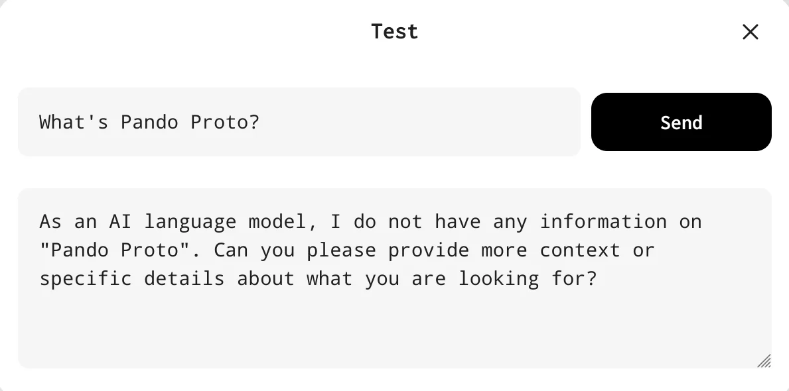
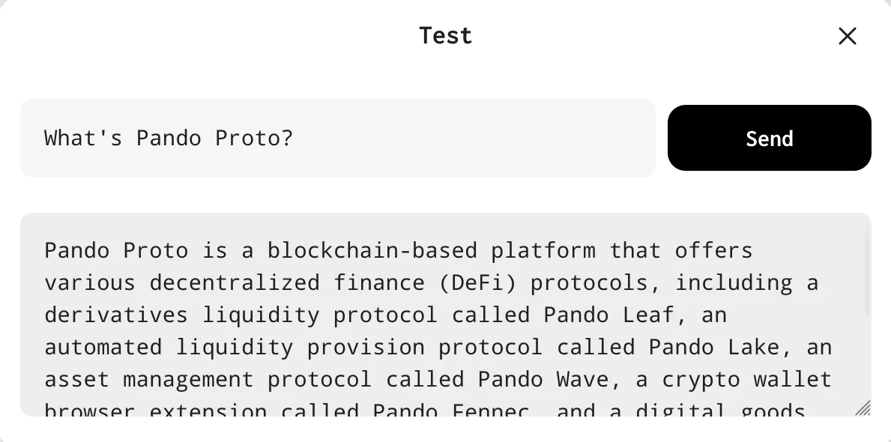

# Botastic

[Botastic](https://github.com/pandodao/botastic) is an AI framework.


## 💡 Motivation

- LLMs are fantastic for knowledge generation and reasoning as they're pre-trained on large amounts of publicly available data.
- In practice, we need LLMs to be able to reason about our own data. Fine-tuning them is often impractical. Embedding data into LLMs is a viable alternative, but requires domain expertise, and considerable effort to dealing with prompt limitations
- Botastic aims to make it easy to embed your own data into LLMs.
- Botastic also aims to provide out-of-the-box solutions to satisfy common use cases.
- It would to be easily integrated into existing systems and scalable to meet business requirements.
- We're building AI-based applications, we need Botastic to simplify the process.

## 🏁 Getting Started

1. visit [https://developers.pando.im/console/botastic](https://developers.pando.im/console/botastic) to get your API key/secret, and create a new bot.
2. run the following command to talk to Botastic

```bash
curl --location --request POST 'https://botastic-api.pando.im/api/conversations/oneway' \
--header 'X-BOTASTIC-APPID: YOUR_BOTASTIC_APP_ID' \
--header 'X-BOTASTIC-SECRET: YOUR_BOTASTIC_APP_SECRET' \
--header 'Content-Type: application/json' \
--data-raw '{
  "bot_id": YOUR_BOTASTIC_BOT_ID,
  "content": "How do you view the future of blockchain, and what benefits does it have for human being? Respond as short as possible like a Zen Master.",
  "category": "plain-text"
}'
```

## 👉 Use Middleware

Botastic's middleware feature allows you to inject additional data into your requests before they are sent to the LLMs. This enables LLMs to access extra knowledge that is not included within themselves, similar to [OpenAI's plugins](https://openai.com/blog/chatgpt-plugins).

To use middlewares, you need to create a new bot with the middleware enabled:

1. visit [https://developers.pando.im/console/botastic](https://developers.pando.im/console/botastic) to create a new bot.
2. tap the bot, and tap the "edit" button
3. fill the "Middleware" field with following code:
    ```json
    {
      "items": 
      [
        {
          "name": "duckduckgo-search", "options": { "limit": 5 }
        }
      ]
    }
    ```
4. add a placeholder to the end of "Prompt" field like that:
    ```handlebars
    I want to you act as a search assistant. 
    Please respond me according following search result:
    {{.MiddlewareOutput}}
    ```
5. tap "Save". Tap the bot again and choose "Test" to test the bot.

You can test the bot with the question "What's Pando Proto?". Without the middleware, the default OpenAI's LLM may have no idea what Pando Proto is. With the middleware, the LLM will be able to search the web and get the answer.

A Question without Duckduckgo middleware:



A Question with Duckduckgo middleware:



## 🍲 Feed Own Data

A common practice is to feed your own data into the LLMs. Botastic provides a simple way to do that, using the `botastic-search` middleware.

The first step is to prepare some data and call [Create Indexes API](../references/botastic/api#create-indexes) to upload your data to botastic.

We provide a tool [botastic-cli](https://github.com/pandodao/botastic-cli) to simplify the process. 

Let's say you have some markdown files in the `./docs` folder, and you want to index them. You can run the following command to index them:

```bash
export BOTASTIC_APP_ID=YOUR_APP_ID
export BOTASTIC_SECRET=YOUR_APP_SECRET
botastic-cli scan --dir ./docs --type md --mode line
```

It will scan all the markdown files in the `./docs` folder and generate a indexes file called `indexes.json`

Then you can using the following command to upload the indexes to botastic:

```bash
botastic-cli index --act create --file ./indexes.json
```

Now you can use the `botastic-search` middleware to search the data you just uploaded.

```json
{
  "items": 
  [
    {
      "name": "botastic-search", "options": { "limit": 3, "app_id": "YOUR_APP_ID" }
    }
  ]
}
```

If you interested in the details, we have a demo project [ask-vitalik-web](https://github.com/pandodao/ask-vitalik-web/). It uses Botastic to build a digital avatar of Vitalik Buterin and feed his blog posts into the LLMs.

## 🤝 Call Multiple Middlewares


In the bot settings, you can pass an array of middleware configurations to the `middlewares` field. By doing this, you can call multiple middlewares sequentially in one request, where the output of the previous middleware is passed to the next middleware as the `MiddlewareOutput` field in the prompt.

This feature offers a wide range of possibilities, such as:

```json
{
  "items": [
    {
      "name": "middleware-1", "options": { /* the options for middleware 1... */ }
    }, {
      "name": "middleware-2", "options": { /* the options for middleware 2... */ }
    }
  ]
}
```

At present, we have some [builtin middlewares](../../docs/references/botastic/middleware.md). We plan to add more middlewares in the future.

## 🌟 Showcases

- [Ask Vitalik](https://ask-vitalik.xingchi.dev): A digital avatar of Vitalik Buterin.
- [Ask Scott Alexander](https://ask-scott.pages.dev/): A digital avatar of Scott Alexander.
  - The author also wrote a [blog post](https://fayezheng.hashnode.dev/effortlessly-develop-custom-chatbots-a-code-light-approach) about how she built it.
 